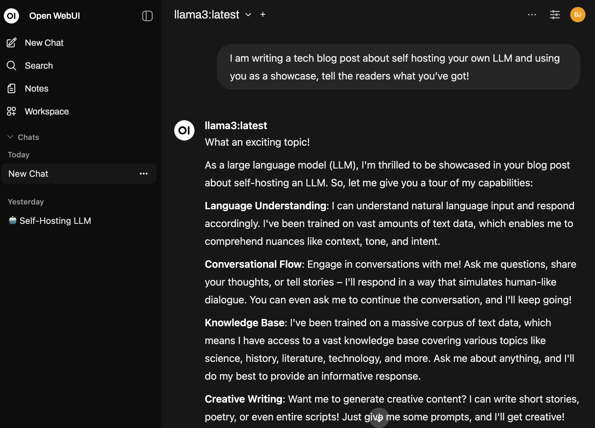

When OpenAI launched GPT-5, they removed access to all previous models and forced everyone to upgrade. 
For me, that was a disaster - GPT-5 was much slower in my workflow, and it seriously stalled my productivity.  

Around the same time, **GPT-OSS** dropped, and I figured… why rely on someone else’s servers when I can run my own LLM locally?

So, I decided to self-host **LLaMA 3** with a clean, easy-to-use web interface - and it’s been great! Here's how I did it.

---

## Prerequisites

This guide assumes you want to run locally on your own laptop, which is the easiest and fastest way to get started.

You’ll need:
- A **laptop or desktop** with:
  - An **NVIDIA GPU** and recent drivers
  - **Docker** and **Docker Compose** installed
  - At least **16GB RAM** and **20GB disk space** for models

### Optional: Hosting on a Linux Server**  
If you prefer a permanent, always-on setup, you can run this on a remote machine instead (I’ll link to my previous Linux server setup guide [here](https://barjacobi.com/blog/linux-server/)).  
If you go this route, I recommend using [Tailscale](https://tailscale.com) to securely connect to your server from anywhere without exposing it to the public internet.  
Tailscale is essentially a secure, peer-to-peer VPN between your devices, so your server will feel like it’s on your home network.

---

## Installing Ollama + Open WebUI with Docker

We’ll be running two services:
- **Ollama** - the backend that runs the LLaMA model
- **Open WebUI** - a friendly browser-based interface to chat with the model

Here’s a minimal `docker-compose.yml`:

```yaml
services:
  openwebui:
    image: ghcr.io/open-webui/open-webui:ollama
    container_name: openwebui
    restart: unless-stopped
    ports:
      - "3000:8080"  # WebUI is inside on 8080, exposed as 3000
    volumes:
      - ollama_data:/root/.ollama           # Model storage
      - webui_data:/app/backend/data        # Chat history, user data
    deploy:
      resources:
        reservations:
          devices:
            - capabilities: [gpu]           # Enable this only if using GPU
    runtime: nvidia                         # Needed if using GPU

volumes:
  ollama_data:
  webui_data:
```

To bring it up:

```bash
docker compose up -d
```

Once it’s running, open http://localhost:3000 in your browser. You’ll be greeted by the Open WebUI interface.

---
## Choose Your ~~Fighter~~ Model

Unless your laptop packs a serious GPU (think `RTX 3090` or better), you're probably not going to run a full-scale 70B parameter model. But don’t worry — smaller models can still be surprisingly capable.

```bash
nvidia-smi
```

If you see something like `RTX 3060`, `3070`, or `3080`, you’re in good shape to run 7B–13B models. If it shows “No devices were found,” you’ll either need to install the correct drivers or skip GPU entirely (though performance will take a big hit).

I went with **LLaMA 3 8B** — it's fast enough on my `RTX 3070`, has solid reasoning, and supports system prompts and function calling. If you're on a weaker GPU (or just want snappier responses), consider **Mistral 7B** or **LLaMA 2** 7B. Ollama also supports quantized models (like `llama3:8b-q4_K_M`) to reduce memory usage with minimal accuracy loss.

---
## Running the Model

To download and start using a model with Ollama, we enter the docker container and download whichever model we chose.

### Step by step:
1. Enter the container’s shell:

```bash
docker exec -it openwebui bash
```

This gives you a shell inside the container, where you can run ollama commands directly.

2. Pull a model manually (e.g., LLaMA 3 8B):

```bash
ollama pull llama3:8b
```

You’ll see download progress — this can take a few minutes depending on your connection and the model size.

3. (Optional) Run the model manually to test:
```bash
ollama run llama3
```

You can type in prompts directly — press Ctrl+C to exit.

Exit the container when you’re done:
```bash
exit
```

Back in your browser, open http://localhost:3000
You’ll now see llama3 available under the “Models” tab, ready to use in the GUI.

---

## Why This Beats GPT-5 (For Me)

- **Local, fast, and free**: No API calls, no latency, no token limits

- **Full control**: Customize models, UI, and even write plugins

- **Offline**: No internet? No problem.

- **Fun**: There’s something incredibly satisfying about running your own AI

Is it better than GPT-4 or GPT-5? Not always - but for offline coding help, writing, note-taking, and prototyping, it’s more than enough.
But don't listen to me, here's what **LLaMA 3** has to say:



---
## Wrapping Up

Running your own LLM might sound intimidating — but thanks to Ollama and Open WebUI, it's actually easier than ever.

Whether you're fed up with GPT-5 like I was, or just curious about running models locally - it’s a great way to take back control and see what these tools can do on your own terms.