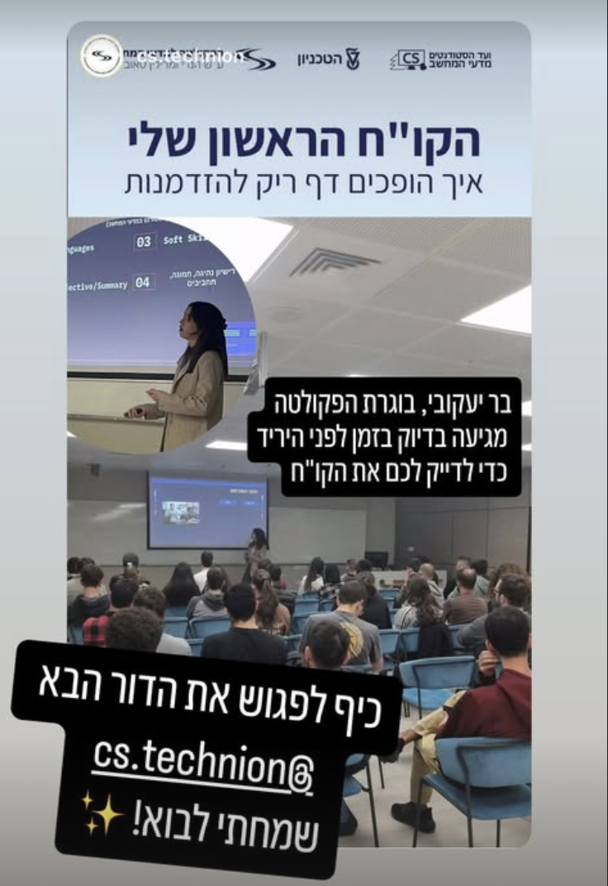

ב-2018, חיפשתי את משרת הסטודנט הראשונה שלי. חוץ מלמלא שקיות בבקבוקים ממותגים וליהנות מאוכל חינם בירידי תעסוקה, לא ממש ידעתי איך להתקדם. איך בכלל כותבים קורות חיים כשאין ניסיון? מאיפה מתחילים?

אחרי לא מעט ניסוי וטעייה, בסוף הצלחתי להתקבל למשרה הראשונה שלי בתעשייה. מאז עברו עוד כמה משרות, ראיונות, אינספור גרסאות של קורות חיים, וכמובן, המון עזרה מסדנאות, קולגות וחברים.

## על הסדנה

כבר הרבה זמן רציתי להעביר את הקארמה הזאת הלאה, לחלוק את הידע והניסיון שצברתי ולהקל על אחרים שעוברים את התהליך הזה.  
לשמחתי, קיבלתי הזדמנות להעביר סדנה לסטודנטים בטכניון.

אז היו כמה דחיות, אילוצים ומלחמה, אבל בסוף אתמול זה קרה! 

היה כיף לחזור למקום שבו הכל התחיל, להסתובב במסדרונות המוכרים, לפגוש סטודנטים עם אותן השאלות שהיו לי אז. זו הייתה חוויה סופר נוסטלגית ומרגשת.

מצרפת כאן את השקופיות מהסדנה, ומקווה שיום אחד, מי שייעזר בזה אולי גם הוא יעביר סדנאות משלו. או לפחות ימצא עבודה 😊

  <iframe src="https://docs.google.com/presentation/d/e/2PACX-1vRnJrKE5b6_H-5qc1NmPZEQoNwzJ5xs1cACDWftLsyNLYJvym0A2aaw_F4OEKk0ykvEZik1uKBhVvI4/embed?start=false&loop=false&delayms=3000"
          frameborder="0"
          style="position: absolute; top: 0; left: 0; width: 100%; height: 100%;"
          allowfullscreen="true"
          mozallowfullscreen="true"
          webkitallowfullscreen="true"></iframe>

