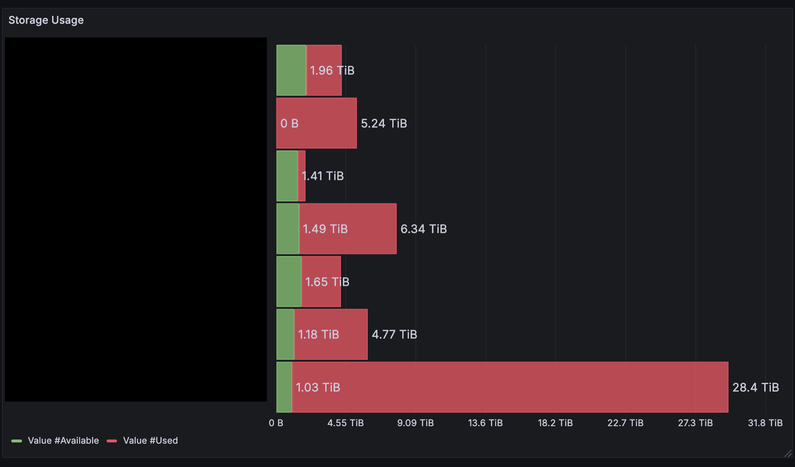

The lab I'm working at has a shared server, and storage space is always a concern.
- 'How much space is left in each directory?' 
- 'Which directories are the largest?' 
- 'Who is using up the most space?' 

These types of questions come up frequently, and we needed a clear way to get a snapshot of the storage situation.

## The Challenge

Since I didn’t have sudo access, I couldn’t install monitoring tools or modify system-wide configurations. So, I had to come up with a solution that didn't require administrative privileges.

I decided to set up a monitoring stack using **Node Exporter**, **Prometheus**, and **Grafana** to track where space was being used. 

This might be an overkill for a simple task, but as an ex-production engineer, I couldn't resist the opportunity to play with the tools I know and love. Here’s how I went about doing it.

## The Setup

### What You’ll Need

Before diving into the setup, you’ll need the following:

- A server where you can run services - if you have `sudo`, great. If not, you can run them as a user like I did.
- If your server has a firewall (like mine), the ability to use SSH port forwarding since direct browser access isn’t possible due to the firewall.

### Setting Up Node Exporter

The first piece of the puzzle was **Node Exporter**, which collects system-level metrics such as storage, CPU usage, and memory. 

#### Installing Node Exporter as a User-Level Service

1. Download the Node Exporter binary from the [Prometheus GitHub releases](https://github.com/prometheus/node_exporter/releases).
2. Extract it to your chosen directory:

   ```bash
   tar -xvzf node_exporter-<version>.tar.gz
   ```

3. Now, we need to run Node Exporter as a user-level service using `systemd`. Create a `node_exporter.service` file in `~/.config/systemd/user/`:

   ```bash
   [Unit]
   Description=Node Exporter

   [Service]
   ExecStart=/path/to/node_exporter
   User=your_username
   Restart=always

   [Install]
   WantedBy=default.target
   ```

4. Enable and start the service:

   ```bash
   systemctl --user enable node_exporter
   systemctl --user start node_exporter
   ```

With the service running, you can access your Node Exporter metrics at `http://localhost:9100`.

#### Accessing Metrics Through SSH Port Binding

Since our server has a firewall, accessing the metrics directly via the browser wasn’t possible. Instead, I used **SSH port forwarding** to forward the Node Exporter port to my local machine.

Here’s the command to forward the port:

```bash
ssh -L 9100:localhost:9100 user@remote-server
```

This binds port `9100` on your local machine to the Node Exporter port on the server, letting you access the metrics from your browser at `http://localhost:9100`.

### Setting Up Prometheus

Next, I set up **Prometheus**, the monitoring system that scrapes metrics from Node Exporter.

1. Download Prometheus from the [official website](https://prometheus.io/download/).
2. Extract the binary and navigate to the directory where you’ve saved it.
3. Modify the `prometheus.yml` configuration file to scrape metrics from the Node Exporter:

   ```yaml
   global:
     scrape_interval: 15s

   scrape_configs:
     - job_name: 'node'
       static_configs:
         - targets: ['localhost:9100']
   ```

4. Start Prometheus with the following command:

   ```bash
   ./prometheus --config.file=prometheus.yml
   ```

To ensure Prometheus runs as a user-level service, create a `prometheus.service` file in `~/.config/systemd/user/`:

```bash
[Unit]
Description=Prometheus

[Service]
ExecStart=/path/to/prometheus --config.file=/path/to/prometheus.yml
User=your_username
Restart=always

[Install]
WantedBy=default.target
```

5. Enable and start the Prometheus service:

   ```bash
   systemctl --user enable prometheus
   systemctl --user start prometheus
   ```

You can access Prometheus at `http://localhost:9090` via the same SSH port forwarding method used for Node Exporter.

### Setting Up Grafana

Finally, I set up **Grafana**, which I use to visualize the metrics collected by Prometheus.

1. Download the Grafana binary from the [official website](https://grafana.com/grafana/download).
2. Extract and start Grafana:

   ```bash
   ./bin/grafana-server web
   ```

3. To make Grafana run as a user-level service, create a `grafana.service` file in `~/.config/systemd/user/`:

   ```bash
   [Unit]
   Description=Grafana

   [Service]
   ExecStart=/path/to/grafana/bin/grafana-server web
   User=your_username
   Restart=always

   [Install]
   WantedBy=default.target
   ```

4. Enable and start the Grafana service:

   ```bash
   systemctl --user enable grafana
   systemctl --user start grafana
   ```

Access Grafana at `http://localhost:3000`. You can log in with the default credentials: `admin`/`admin`.

### Example Dashboard
With the monitoring stack in place, I created some dashboards. One of them was to visualize storage usage across our multiple storage volumes. 




I used a stacked bar chart, where each device had a bar showing both used (in red) and available space (in green). The data was pulled from Prometheus, using the `node_filesystem_avail_bytes` and `node_filesystem_size_bytes` metrics.

I grouped the data by directory, with the X-axis showing device names and the Y-axis representing storage in bytes. I blacked out the directory names in this picture.

## Conclusion
And that’s it! I now have a complete monitoring stack running without `sudo`. 

- I can visualize storage usage on the server.
- Track the available disk space.
- See which directories are using the most space.

Since everything runs as user-level services, I don't need root access. Plus, it’s all wrapped up in a shiny Grafana dashboard.

If you want to add more metrics or create additional dashboards, Grafana makes it super easy to customize. Now that the system is set up, adding new monitoring services is as easy as tweaking a few configuration files.

Happy monitoring!
